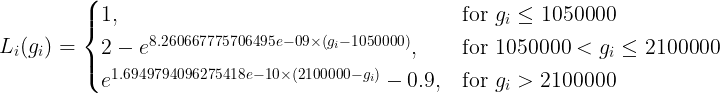

# 5. Sistema de Cuotas

### 5.1 Visión general

El Sistema de Cuotas de VinuChain representa una innovación pionera en la industria del blockchain, con el concepto original de un sistema de cuotas construido en Vite Chain. Construido en torno al staking incentivado, el Sistema de Cuotas introduce un nuevo paradigma para la ejecución de transacciones que sirve para dar cabida a las diversas necesidades de los usuarios de la red.

En esencia, el Sistema de Cuotas de VinuChain funciona bajo la premisa de la asignación de cuotas para las transacciones. Al stakear una cantidad mínima predefinida del token nativo, los participantes de VC en la red ganan una cuota diaria que les permite realizar transacciones en la red sin incurrir en gastos. Esta cuota, calculada en función de varios factores, entre ellos la cantidad y la duración del stake, se actualiza en un ciclo de 24 horas, ofreciendo a las partes interesadas un acceso constante a las capacidades transaccionales.

Para evitar la asignación desproporcionada de cuotas y mantener un uso equitativo de la red, existe un umbral máximo de cuota. Este límite establece un equilibrio óptimo entre incentivar una participación sustancial en tokens y evitar una concentración indebida de poder transaccional.

La característica más destacada del sistema de cuotas es su mecanismo de devolución de efectivo. A medida que los interesados realizan transacciones, se les reembolsa el equivalente de las cuotas de gas, lo que permite realizar transacciones sin necesidad de comisiones. Este reembolso se facilita a través de una inflación calculada del token VC nativo, financiando así de forma sostenible el mecanismo de devolución de efectivo.

El Sistema de Cuotas, sin embargo, no es aplicable a los participantes que decidan no stakear o a aquellos que stakeen pero no alcancen el umbral mínimo. Estos usuarios pueden seguir interactuando con la red VinuChain a través de transacciones estándar que conllevan comisiones regulares. Estas tarifas se determinan dinámicamente en función de factores como la congestión de la red y el uso general. Esto garantiza que todos los usuarios se beneficien de la arquitectura escalable y de alta velocidad de VinuChain sin costes prohibitivos.

El sistema de cuotas es especialmente ventajoso para implementar microtransacciones eficientes, una faceta que a menudo se pasa por alto en las redes blockchain tradicionales debido a las elevadas tarifas de transacción. Las empresas y aplicaciones pueden integrar sin problemas modelos de microtransacciones en sus sistemas con el Quota System, aportando un mayor valor a sus usuarios.

### 5.2 Mecanismo de devolución de gas

El backend calcula el reembolso que un usuario con cuota debe recibir al día (de 00:00 am a 23:59 pm UTC). A la 01:00 am comienza el airdrop, donde se devuelve el precio del gas a cada usuario de acuerdo con el cálculo que se presentará a continuación.

EOA (Externally Owned Address) es una dirección Ether propiedad de un par de claves, en contraste con la dirección de contrato inteligente, que es controlada por un código desplegado en la blockchain (wallet).

La cuota es un tope acumulativo que tiene cada EOA, dependiendo del número de tokens stakeados por una dirección, la actividad de la dirección en la red y la carga global de la red.

### 5.3 Cuota de gas cero

La cuota de gas cero estará disponible de la siguiente manera:

1. Para cada transacción, se calcula la devolución de la cuota de la dirección remitente de la transacción (el que envía), pero no más que el gasUsed (gas Usado).
2. Se elimina, de la dirección, la cuota utilizada en el paso anterior. Haciendo que para la siguiente transacción de esta dirección, de este bloque y siguientes, la cuota disponible disminuya (ignorando el aumento de cuota que se produce cada bloque - de hecho, si la transacción es lo suficientemente pequeña, la cuota disponible puede no cambiar o aumentar).
3. El sistema airdrop devolverá a los usuarios el gas utilizado de acuerdo con la cuota.

### 5.4 Teoría

La cuota de EOA para el bloque i se calcula mediante la fórmula:

Qi(gi, i)=M(1-21+eLi(gi) i ),

Donde:

* gi – cuota media por bloque utilizada en la red por todas las direcciones de los bloques: \[i-75, i-1]
* i – número de fichas stakeadas por esta dirección en el bloque i
* Li(gi) – parámetro de carga de la red en el bloque i
* M = 1000000
* \= 3.13478991\*10^(-22)

El parámetro de carga de la red se calcula como:

<figure><figcaption></figcaption></figure>

Para obtener el saldo de cuota actual de una dirección se necesita:

Q(i)=(j=i-74iQj) - (j=i-74iUj),

Donde Uj – cuota, utilizada por esta dirección en el bloque j.

Utilizando los datos recogidos anteriormente, es elemental calcular Q(i) direcciones en algún bloque i.

La cuota disponible de una cuenta depende de los UTPS y del consumo de cuota durante los últimos 74 bloques de instantáneas. Por ejemplo, la cuenta A recibe una cuota de 1 UTPS a través del staking, no se produce ninguna transacción durante los últimos 74 bloques de instantáneas, en este caso, la cuota disponible de la cuenta A es de 75 UT.

UTPS: Transacciones unitarias por segundo, se refiere al número de transacciones unitarias que una cuenta puede enviar en un segundo.

UTPS=Qi/21000​

UTPE: Transacciones unitarias por época, referidas al número de transacciones unitarias que una cuenta puede enviar en 75 bloques de instantáneas.

UTPE=UTPS×75

La cuota disponible de una cuenta depende de UTPS y del consumo de cuota durante los últimos 74 bloques de instantáneas. Por ejemplo, la cuenta A recibe 1 UTPS de cuota a través del staking, no se produce ninguna transacción durante los últimos 74 bloques de instantáneas, en este caso, la cuota disponible de la cuenta A es de 75 UT.

### 5.5 Límite de cuota

Para una única transacción, la cuota máxima que se puede consumir se define como 47,62 UT.

_Para mayor comodidad en el cálculo, resulta práctico calcular el valor de (ξi×ρ) y luego asignar el resultado a la cuota de acuerdo con la siguiente tabla:_

<table data-header-hidden><thead><tr><th width="252"></th><th width="95"></th><th width="82"></th><th width="95"></th><th></th></tr></thead><tbody><tr><td>(ξi×ρ)</td><td>Q</td><td>UTPS</td><td>UTPE</td><td>Aproximadamente equivalente al VC en staking</td></tr><tr><td>0.0</td><td>0</td><td>0</td><td>0</td><td>0</td></tr><tr><td>(0,0.0005600000146345639]</td><td>280</td><td>1/75</td><td>1</td><td>134</td></tr><tr><td>(0.0005600000146345639,0.0011200001170773874]</td><td>560</td><td>2/75</td><td>2</td><td>267</td></tr><tr><td>(0.0011200001170773874,0.0016800003951362111]</td><td>840</td><td>3/75</td><td>3</td><td>400</td></tr><tr><td>(0.0016800003951362111,0.002240000936619286]</td><td>1120</td><td>4/75</td><td>4</td><td>534</td></tr><tr><td>(0.002240000936619286,0.002800001829335484]</td><td>1400</td><td>5/75</td><td>5</td><td>667</td></tr><tr><td>(0.002800001829335484,0.003360003161093523]</td><td>1680</td><td>6/75</td><td>6</td><td>800</td></tr><tr><td>(0.003360003161093523,0.003920005019702078]</td><td>1960</td><td>7/75</td><td>7</td><td>934</td></tr><tr><td>(0.003920005019702078,0.004480007492972107]</td><td>2240</td><td>8/75</td><td>8</td><td>1067</td></tr><tr><td>(0.004480007492972107,0.0050400106687125265]</td><td>2520</td><td>9/75</td><td>9</td><td>1200</td></tr><tr><td>(0.0050400106687125265,0.005600014634735637]</td><td>2800</td><td>10/75</td><td>10</td><td>1334</td></tr><tr><td>(0.005600014634735637,0.006160019478852362]</td><td>3080</td><td>11/75</td><td>11</td><td>1467</td></tr><tr><td>(0.006160019478852362,0.006720025288875452]</td><td>3360</td><td>12/75</td><td>12</td><td>1600</td></tr><tr><td>(0.006720025288875452,0.0072800321526182606]</td><td>3640</td><td>13/75</td><td>13</td><td>1733</td></tr><tr><td>(0.0072800321526182606,0.007840040157895736]</td><td>3920</td><td>14/75</td><td>14</td><td>1867</td></tr><tr><td>(0.007840040157895736,0.008400049392522762]</td><td>4200</td><td>15/75</td><td>15</td><td>2000</td></tr><tr><td>(0.008400049392522762,0.008960059944316465]</td><td>4480</td><td>16/75</td><td>16</td><td>2133</td></tr><tr><td>(0.008960059944316465,0.009520071901094992]</td><td>4760</td><td>17/75</td><td>17</td><td>2267</td></tr><tr><td>(0.009520071901094992,0.01008008535067674]</td><td>5040</td><td>18/75</td><td>18</td><td>2400</td></tr><tr><td>(0.01008008535067674,0.010640100380883094]</td><td>5320</td><td>19/75</td><td>19</td><td>2533</td></tr><tr><td>(0.010640100380883094,0.011200117079536328]</td><td>5600</td><td>20/75</td><td>20</td><td>2667</td></tr><tr><td>(0.011200117079536328,0.011760135534459705]</td><td>5880</td><td>21/75</td><td>21</td><td>2800</td></tr><tr><td>(0.011760135534459705,0.012320155833478902]</td><td>6160</td><td>22/75</td><td>22</td><td>2933</td></tr><tr><td>(0.012320155833478902,0.012880178064420343]</td><td>6440</td><td>23/75</td><td>23</td><td>3066</td></tr><tr><td>(0.012880178064420343,0.013440202315113498]</td><td>6720</td><td>24/75</td><td>24</td><td>3200</td></tr><tr><td>(0.013440202315113498,0.01400022867338966]</td><td>7000</td><td>25/75</td><td>25</td><td>3333</td></tr><tr><td>(0.01400022867338966,0.01456025722708073]</td><td>7280</td><td>26/75</td><td>26</td><td>3466</td></tr><tr><td>(0.01456025722708073,0.015120288064022377]</td><td>7560</td><td>27/75</td><td>27</td><td>3600</td></tr><tr><td>(0.015120288064022377,0.015680321272051077]</td><td>7840</td><td>28/75</td><td>28</td><td>3733</td></tr><tr><td>(0.015680321272051077,0.01624035693900638]</td><td>8120</td><td>29/75</td><td>29</td><td>3866</td></tr><tr><td>(0.01624035693900638,0.016800395152729273]</td><td>8400</td><td>30/75</td><td>30</td><td>4000</td></tr><tr><td>(0.016800395152729273,0.017360436001064444]</td><td>8680</td><td>31/75</td><td>31</td><td>4133</td></tr><tr><td>(0.017360436001064444,0.01792047957185776]</td><td>8960</td><td>32/75</td><td>32</td><td>4266</td></tr><tr><td>(0.01792047957185776,0.018480525952958973]</td><td>9240</td><td>33/75</td><td>33</td><td>4400</td></tr><tr><td>(0.018480525952958973,0.019040575232219203]</td><td>9520</td><td>34/75</td><td>34</td><td>4533</td></tr><tr><td>(0.019040575232219203,0.019600627497492765]</td><td>9800</td><td>35/75</td><td>35</td><td>4666</td></tr><tr><td>(0.019600627497492765,0.020160682836636825]</td><td>10080</td><td>36/75</td><td>36</td><td>4799</td></tr><tr><td>(0.020160682836636825,0.020720741337511922]</td><td>10360</td><td>37/75</td><td>37</td><td>4933</td></tr><tr><td>(0.020720741337511922,0.021280803087980315]</td><td>10640</td><td>38/75</td><td>38</td><td>5066</td></tr><tr><td>(0.021280803087980315,0.021840868175909127]</td><td>10920</td><td>39/75</td><td>39</td><td>5199</td></tr><tr><td>(0.021840868175909127,0.022400936689166498]</td><td>11200</td><td>40/75</td><td>40</td><td>5333</td></tr><tr><td>(0.022400936689166498,0.022961008715626032]</td><td>11480</td><td>41/75</td><td>41</td><td>5466</td></tr><tr><td>(0.022961008715626032,0.02352108434316254]</td><td>11760</td><td>42/75</td><td>42</td><td>5599</td></tr><tr><td>(0.02352108434316254,0.024081163659656016]</td><td>12040</td><td>43/75</td><td>43</td><td>5733</td></tr><tr><td>(0.024081163659656016,0.02464124675298827]</td><td>12320</td><td>44/75</td><td>44</td><td>5866</td></tr><tr><td>(0.02464124675298827,0.025201333711046034]</td><td>12600</td><td>45/75</td><td>45</td><td>5999</td></tr><tr><td>(0.025201333711046034,0.025761424621719303]</td><td>12880</td><td>46/75</td><td>46</td><td>6133</td></tr><tr><td>(0.025761424621719303,0.02632151957290144]</td><td>13160</td><td>47/75</td><td>47</td><td>6266</td></tr><tr><td>(0.02632151957290144,0.026881618652489236]</td><td>13440</td><td>48/75</td><td>48</td><td>6399</td></tr><tr><td>(0.026881618652489236,0.027441721948384734]</td><td>13720</td><td>49/75</td><td>49</td><td>6533</td></tr><tr><td>(0.027441721948384734,0.028001829548493135]</td><td>14000</td><td>50/75</td><td>50</td><td>6666</td></tr><tr><td>(0.028001829548493135,0.02856194154072289]</td><td>14280</td><td>51/75</td><td>51</td><td>6799</td></tr><tr><td>(0.02856194154072289,0.02912205801298835]</td><td>14560</td><td>52/75</td><td>52</td><td>6933</td></tr><tr><td>(0.02912205801298835,0.029682179053206414]</td><td>14840</td><td>53/75</td><td>53</td><td>7066</td></tr><tr><td>(0.029682179053206414,0.030242304749299606]</td><td>15120</td><td>54/75</td><td>54</td><td>7199</td></tr><tr><td>(0.030242304749299606,0.030802435189193574]</td><td>15400</td><td>55/75</td><td>55</td><td>7333</td></tr><tr><td>(0.030802435189193574,0.03136257046081975]</td><td>15680</td><td>56/75</td><td>56</td><td>7466</td></tr><tr><td>(0.03136257046081975,0.03192271065211283]</td><td>15960</td><td>57/75</td><td>57</td><td>7599</td></tr><tr><td>(0.03192271065211283,0.03248285585101344]</td><td>16240</td><td>58/75</td><td>58</td><td>7733</td></tr><tr><td>(0.03248285585101344,0.03304300614546563]</td><td>16520</td><td>59/75</td><td>59</td><td>7866</td></tr><tr><td>(0.03304300614546563,0.033603161623419094]</td><td>16800</td><td>60/75</td><td>60</td><td>7999</td></tr><tr><td>(0.033603161623419094,0.03416332237282837]</td><td>17080</td><td>61/75</td><td>61</td><td>8133</td></tr><tr><td>(0.03416332237282837,0.03472348848165249]</td><td>17360</td><td>62/75</td><td>62</td><td>8266</td></tr><tr><td>(0.03472348848165249,0.03528366003785593]</td><td>17640</td><td>63/75</td><td>63</td><td>8399</td></tr><tr><td>(0.03528366003785593,0.03584383712940819]</td><td>17920</td><td>64/75</td><td>64</td><td>8533</td></tr><tr><td>(0.03584383712940819,0.036404019844283514]</td><td>18200</td><td>65/75</td><td>65</td><td>8666</td></tr><tr><td>(0.036404019844283514,0.036964208270462595]</td><td>18480</td><td>66/75</td><td>66</td><td>8799</td></tr><tr><td>(0.036964208270462595,0.037524402495930566]</td><td>18760</td><td>67/75</td><td>67</td><td>8933</td></tr><tr><td>(0.037524402495930566,0.038084602608677874]</td><td>19040</td><td>68/75</td><td>68</td><td>9066</td></tr><tr><td>(0.038084602608677874,0.03864480869670122]</td><td>19320</td><td>69/75</td><td>69</td><td>9199</td></tr><tr><td>(0.03864480869670122,0.03920502084800278]</td><td>19600</td><td>70/75</td><td>70</td><td>9333</td></tr><tr><td>(0.03920502084800278,0.039765239150590236]</td><td>19880</td><td>71/75</td><td>71</td><td>9466</td></tr><tr><td>(0.039765239150590236,0.04032546369247644]</td><td>20160</td><td>72/75</td><td>72</td><td>9599</td></tr><tr><td>(0.04032546369247644,0.04088569456168163]</td><td>20440</td><td>73/75</td><td>73</td><td>9733</td></tr><tr><td>(0.04088569456168163,0.04144593184623087]</td><td>20720</td><td>74/75</td><td>74</td><td>9866</td></tr><tr><td>(0,0.042006175634155006]</td><td>21000</td><td>1</td><td>75</td><td>10000</td></tr><tr><td>(0.042006175634155006,0.08404944434245186]</td><td>42000</td><td>2</td><td>150</td><td>20007</td></tr><tr><td>(0.08404944434245186,0.1261670961035256]</td><td>63000</td><td>3</td><td>225</td><td>30033</td></tr><tr><td>(0.1261670961035256,0.16839681732546105]</td><td>84000</td><td>4</td><td>300</td><td>40085</td></tr><tr><td>(0.16839681732546105,0.2107768956769977]</td><td>105000</td><td>5</td><td>375</td><td>50173</td></tr><tr><td>(0.2107768956769977,0.25334643304410037]</td><td>126000</td><td>6</td><td>450</td><td>60306</td></tr><tr><td>(0.25334643304410037,0.2961455696376917]</td><td>147000</td><td>7</td><td>525</td><td>70494</td></tr><tr><td>(0.2961455696376917,0.3392157225669637]</td><td>168000</td><td>8</td><td>600</td><td>80746</td></tr><tr><td>(0.3392157225669637,0.382599842575369]</td><td>189000</td><td>9</td><td>675</td><td>91073</td></tr><tr><td>(0.382599842575369,0.4263426931297194]</td><td>210000</td><td>10</td><td>750</td><td>101486</td></tr><tr><td>(0.4263426931297194,0.4704911566788094]</td><td>231000</td><td>11</td><td>825</td><td>111995</td></tr><tr><td>(0.4704911566788094,0.5150945736855665]</td><td>252000</td><td>12</td><td>900</td><td>122612</td></tr><tr><td>(0.5150945736855665,0.5602051210238872]</td><td>273000</td><td>13</td><td>975</td><td>133350</td></tr><tr><td>(0.5602051210238872,0.605878237567604]</td><td>294000</td><td>14</td><td>1050</td><td>144222</td></tr><tr><td>(0.605878237567604,0.6521731063496397]</td><td>315000</td><td>15</td><td>1125</td><td>155241</td></tr><tr><td>(0.6521731063496397,0.6991532046201573]</td><td>336000</td><td>16</td><td>1200</td><td>166424</td></tr><tr><td>(0.6991532046201573,0.7468869355972497]</td><td>357000</td><td>17</td><td>1275</td><td>177787</td></tr><tr><td>(0.7468869355972497,0.7954483588344243]</td><td>378000</td><td>18</td><td>1350</td><td>189346</td></tr><tr><td>(0.7954483588344243,0.8449180401302736]</td><td>399000</td><td>19</td><td>1425</td><td>201122</td></tr><tr><td>(0.8449180401302736,0.8953840470548413]</td><td>420000</td><td>20</td><td>1500</td><td>213135</td></tr><tr><td>(0.8953840470548413,0.9469431228444231]</td><td>441000</td><td>21</td><td>1575</td><td>225407</td></tr><tr><td>(0.9469431228444231,0.9997020801479394]</td><td>462000</td><td>22</td><td>1650</td><td>237966</td></tr><tr><td>(0.9997020801479394,1.053779467629503]</td><td>483000</td><td>23</td><td>1725</td><td>250838</td></tr><tr><td>(1.053779467629503,1.1093075777848576]</td><td>504000</td><td>24</td><td>1800</td><td>264056</td></tr><tr><td>(1.1093075777848576,1.1664348850068706]</td><td>525000</td><td>25</td><td>1875</td><td>277654</td></tr><tr><td>(1.1664348850068706,1.2253290311060194]</td><td>546000</td><td>26</td><td>1950</td><td>291673</td></tr><tr><td>(1.2253290311060194,1.286180514353531]</td><td>567000</td><td>27</td><td>2025</td><td>306158</td></tr><tr><td>(1.286180514353531,1.3492072924575544]</td><td>588000</td><td>28</td><td>2100</td><td>321161</td></tr><tr><td>(1.3492072924575544,1.4146605870070175]</td><td>609000</td><td>29</td><td>2175</td><td>336741</td></tr><tr><td>(1.4146605870070175,1.4828322881625378]</td><td>630000</td><td>30</td><td>2250</td><td>352969</td></tr><tr><td>(1.4828322881625378,1.554064521717701]</td><td>651000</td><td>31</td><td>2325</td><td>369924</td></tr><tr><td>(1.554064521717701,1.6287621852605034]</td><td>672000</td><td>32</td><td>2400</td><td>387705</td></tr><tr><td>(1.6287621852605034,1.707409634545938]</td><td>693000</td><td>33</td><td>2475</td><td>406426</td></tr><tr><td>(1.707409634545938,1.7905932883378723]</td><td>714000</td><td>34</td><td>2550</td><td>426227</td></tr><tr><td>(1.7905932883378723,1.8790328663947373]</td><td>735000</td><td>35</td><td>2625</td><td>447279</td></tr><tr><td>(1.8790328663947373,1.97362554890186]</td><td>756000</td><td>36</td><td>2700</td><td>469795</td></tr><tr><td>(1.97362554890186,2.0755100566945326]</td><td>777000</td><td>37</td><td>2775</td><td>494048</td></tr><tr><td>(2.0755100566945326,2.186162517630361]</td><td>798000</td><td>38</td><td>2850</td><td>520387</td></tr><tr><td>(2.186162517630361,2.3075451472522963]</td><td>819000</td><td>39</td><td>2925</td><td>549280</td></tr><tr><td>(2.3075451472522963,2.4423470353692043]</td><td>840000</td><td>40</td><td>3000</td><td>581368</td></tr><tr><td>(2.4423470353692043,2.594395323511559]</td><td>861000</td><td>41</td><td>3075</td><td>617561</td></tr><tr><td>(2.594395323511559,2.7694056956796604]</td><td>882000</td><td>42</td><td>3150</td><td>659220</td></tr><tr><td>(2.7694056956796604,2.976475888792767]</td><td>903000</td><td>43</td><td>3225</td><td>708510</td></tr><tr><td>(2.976475888792767,3.2314282909393213]</td><td>924000</td><td>44</td><td>3300</td><td>769198</td></tr><tr><td>(3.2314282909393213,3.5656840708200748]</td><td>945000</td><td>45</td><td>3375</td><td>848763</td></tr><tr><td>(3.5656840708200748,4.057395776090949]</td><td>966000</td><td>46</td><td>3450</td><td>965808</td></tr><tr><td>(4.057395776090949,5.029431885090279]</td><td>987000</td><td>47</td><td>3525</td><td>1197189</td></tr></tbody></table>

Li(gi) en la fórmula de cálculo de la cuota es específicamente para este propósito.

_La siguiente tabla muestra la cantidad mínima de staking requerida para enviar una operación de transferencia sin comentarios en diferentes situaciones de congestión:_

<table data-header-hidden><thead><tr><th width="239.33333333333331"></th><th></th><th></th></tr></thead><tbody><tr><td>Consumo medio de cuota durante los últimos 74 bloques de instantáneas (UT)</td><td>Factor de congestión</td><td>Cantidad mínima de staking (VC)</td></tr><tr><td>0-50</td><td>1</td><td>134</td></tr><tr><td>51</td><td>0.987079620361328125</td><td>135</td></tr><tr><td>52</td><td>0.97399139404296875</td><td>137</td></tr><tr><td>53</td><td>0.960735321044921875</td><td>139</td></tr><tr><td>54</td><td>0.947307586669921875</td><td>141</td></tr><tr><td>55</td><td>0.93370819091796875</td><td>143</td></tr><tr><td>56</td><td>0.919933319091796875</td><td>145</td></tr><tr><td>57</td><td>0.905979156494140625</td><td>147</td></tr><tr><td>58</td><td>0.891841888427734375</td><td>150</td></tr><tr><td>59</td><td>0.877529144287109375</td><td>152</td></tr><tr><td>60</td><td>0.8630218505859375</td><td>155</td></tr><tr><td>61</td><td>0.84833526611328125</td><td>157</td></tr><tr><td>62</td><td>0.833454132080078125</td><td>160</td></tr><tr><td>63</td><td>0.81838226318359375</td><td>163</td></tr><tr><td>64</td><td>0.8031158447265625</td><td>166</td></tr><tr><td>65</td><td>0.787654876708984375</td><td>170</td></tr><tr><td>66</td><td>0.771991729736328125</td><td>173</td></tr><tr><td>67</td><td>0.756122589111328125</td><td>177</td></tr><tr><td>68</td><td>0.740055084228515625</td><td>181</td></tr><tr><td>69</td><td>0.72377777099609375</td><td>185</td></tr><tr><td>70</td><td>0.707286834716796875</td><td>189</td></tr><tr><td>71</td><td>0.690586090087890625</td><td>194</td></tr><tr><td>72</td><td>0.67366790771484375</td><td>198</td></tr><tr><td>73</td><td>0.656536102294921875</td><td>204</td></tr><tr><td>74</td><td>0.6391754150390625</td><td>209</td></tr><tr><td>75</td><td>0.621593475341796875</td><td>215</td></tr><tr><td>76</td><td>0.603786468505859375</td><td>221</td></tr><tr><td>77</td><td>0.58574676513671875</td><td>228</td></tr><tr><td>78</td><td>0.567474365234375</td><td>236</td></tr><tr><td>79</td><td>0.548969268798828125</td><td>244</td></tr><tr><td>80</td><td>0.53022003173828125</td><td>252</td></tr><tr><td>81</td><td>0.51123046875</td><td>262</td></tr><tr><td>82</td><td>0.491994857788085938</td><td>272</td></tr><tr><td>83</td><td>0.472513198852539062</td><td>283</td></tr><tr><td>84</td><td>0.452777862548828125</td><td>295</td></tr><tr><td>85</td><td>0.432788848876953125</td><td>309</td></tr><tr><td>86</td><td>0.412540435791015625</td><td>324</td></tr><tr><td>87</td><td>0.392030715942382812</td><td>341</td></tr><tr><td>88</td><td>0.371255874633789062</td><td>360</td></tr><tr><td>89</td><td>0.350214004516601562</td><td>382</td></tr><tr><td>90</td><td>0.328899383544921875</td><td>407</td></tr><tr><td>91</td><td>0.307306289672851562</td><td>436</td></tr><tr><td>92</td><td>0.28543853759765625</td><td>469</td></tr><tr><td>93</td><td>0.263286590576171875</td><td>508</td></tr><tr><td>94</td><td>0.240848541259765625</td><td>556</td></tr><tr><td>95</td><td>0.218120574951171875</td><td>614</td></tr><tr><td>96</td><td>0.195098876953125</td><td>686</td></tr><tr><td>97</td><td>0.171779632568359375</td><td>780</td></tr><tr><td>98</td><td>0.148159980773925781</td><td>904</td></tr><tr><td>99</td><td>0.124234199523925781</td><td>1078</td></tr><tr><td>100</td><td>0.0999999046325683594</td><td>1339</td></tr><tr><td>101</td><td>0.0997366905212402344</td><td>1343</td></tr><tr><td>102</td><td>0.0994729995727539062</td><td>1347</td></tr><tr><td>103</td><td>0.0992097854614257812</td><td>1350</td></tr><tr><td>104</td><td>0.0989465713500976562</td><td>1354</td></tr><tr><td>105</td><td>0.0986838340759277344</td><td>1357</td></tr><tr><td>106</td><td>0.0984206199645996094</td><td>1361</td></tr><tr><td>107</td><td>0.0981578826904296875</td><td>1365</td></tr><tr><td>108</td><td>0.0978946685791015625</td><td>1368</td></tr><tr><td>109</td><td>0.0976319313049316406</td><td>1372</td></tr><tr><td>110</td><td>0.0973691940307617188</td><td>1376</td></tr><tr><td>111</td><td>0.0971064567565917969</td><td>1379</td></tr><tr><td>112</td><td>0.0968441963195800781</td><td>1383</td></tr><tr><td>113</td><td>0.0965814590454101562</td><td>1387</td></tr><tr><td>114</td><td>0.0963191986083984375</td><td>1391</td></tr><tr><td>115</td><td>0.0960564613342285156</td><td>1395</td></tr><tr><td>116</td><td>0.0957942008972167969</td><td>1398</td></tr><tr><td>117</td><td>0.0955319404602050781</td><td>1402</td></tr><tr><td>118</td><td>0.0952696800231933594</td><td>1406</td></tr><tr><td>119</td><td>0.0950074195861816406</td><td>1410</td></tr><tr><td>120</td><td>0.0947461128234863281</td><td>1414</td></tr><tr><td>121</td><td>0.0944838523864746094</td><td>1418</td></tr><tr><td>122</td><td>0.0942220687866210938</td><td>1422</td></tr><tr><td>123</td><td>0.093959808349609375</td><td>1426</td></tr><tr><td>124</td><td>0.0936980247497558594</td><td>1430</td></tr><tr><td>125</td><td>0.0934362411499023438</td><td>1434</td></tr><tr><td>126</td><td>0.0931744575500488281</td><td>1438</td></tr><tr><td>127</td><td>0.0929136276245117188</td><td>1442</td></tr><tr><td>128</td><td>0.0926518440246582031</td><td>1446</td></tr><tr><td>129</td><td>0.0923900604248046875</td><td>1450</td></tr><tr><td>130</td><td>0.0921292304992675781</td><td>1454</td></tr><tr><td>131</td><td>0.0918679237365722656</td><td>1458</td></tr><tr><td>132</td><td>0.09160614013671875</td><td>1462</td></tr><tr><td>133</td><td>0.0913453102111816406</td><td>1466</td></tr><tr><td>134</td><td>0.0910844802856445312</td><td>1471</td></tr><tr><td>135</td><td>0.0908231735229492188</td><td>1475</td></tr><tr><td>136</td><td>0.0905623435974121094</td><td>1479</td></tr><tr><td>137</td><td>0.090301513671875</td><td>1483</td></tr><tr><td>138</td><td>0.0900406837463378906</td><td>1488</td></tr><tr><td>139</td><td>0.0897798538208007812</td><td>1492</td></tr><tr><td>140</td><td>0.089519500732421875</td><td>1496</td></tr><tr><td>141</td><td>0.0892586708068847656</td><td>1501</td></tr><tr><td>142</td><td>0.0889983177185058594</td><td>1505</td></tr><tr><td>143</td><td>0.08873748779296875</td><td>1510</td></tr><tr><td>144</td><td>0.0884771347045898438</td><td>1514</td></tr><tr><td>145</td><td>0.0882167816162109375</td><td>1518</td></tr><tr><td>146</td><td>0.0879564285278320312</td><td>1523</td></tr><tr><td>147</td><td>0.0876965522766113281</td><td>1527</td></tr><tr><td>148</td><td>0.0874361991882324219</td><td>1532</td></tr><tr><td>149</td><td>0.0871763229370117188</td><td>1537</td></tr><tr><td>150</td><td>0.0869164466857910156</td><td>1541</td></tr><tr><td>151</td><td>0.0866560935974121094</td><td>1546</td></tr><tr><td>152</td><td>0.0863962173461914062</td><td>1550</td></tr><tr><td>153</td><td>0.0861368179321289062</td><td>1555</td></tr><tr><td>154</td><td>0.0858774185180664062</td><td>1560</td></tr><tr><td>155</td><td>0.0856170654296875</td><td>1565</td></tr><tr><td>156</td><td>0.085357666015625</td><td>1569</td></tr><tr><td>157</td><td>0.0850982666015625</td><td>1574</td></tr><tr><td>158</td><td>0.0848388671875</td><td>1579</td></tr><tr><td>159</td><td>0.0845794677734375</td><td>1584</td></tr><tr><td>160</td><td>0.0843205451965332031</td><td>1589</td></tr><tr><td>161</td><td>0.0840606689453125</td><td>1594</td></tr><tr><td>162</td><td>0.0838017463684082031</td><td>1599</td></tr><tr><td>163</td><td>0.0835423469543457031</td><td>1603</td></tr><tr><td>164</td><td>0.0832834243774414062</td><td>1608</td></tr><tr><td>165</td><td>0.0830245018005371094</td><td>1613</td></tr><tr><td>166</td><td>0.0827655792236328125</td><td>1619</td></tr><tr><td>167</td><td>0.0825066566467285156</td><td>1624</td></tr><tr><td>168</td><td>0.0822482109069824219</td><td>1629</td></tr><tr><td>169</td><td>0.081989288330078125</td><td>1634</td></tr><tr><td>170</td><td>0.0817308425903320312</td><td>1639</td></tr><tr><td>171</td><td>0.0814719200134277344</td><td>1644</td></tr><tr><td>172</td><td>0.0812134742736816406</td><td>1649</td></tr><tr><td>173</td><td>0.08095550537109375</td><td>1655</td></tr><tr><td>174</td><td>0.0806970596313476562</td><td>1660</td></tr><tr><td>175</td><td>0.0804386138916015625</td><td>1665</td></tr><tr><td>176</td><td>0.0801806449890136719</td><td>1671</td></tr><tr><td>177</td><td>0.0799221992492675781</td><td>1676</td></tr><tr><td>178</td><td>0.0796642303466796875</td><td>1682</td></tr><tr><td>179</td><td>0.0794062614440917969</td><td>1687</td></tr><tr><td>180</td><td>0.0791482925415039062</td><td>1693</td></tr><tr><td>181</td><td>0.0788903236389160156</td><td>1698</td></tr><tr><td>182</td><td>0.078632354736328125</td><td>1704</td></tr><tr><td>183</td><td>0.0783748626708984375</td><td>1709</td></tr><tr><td>184</td><td>0.07811737060546875</td><td>1715</td></tr><tr><td>185</td><td>0.0778594017028808594</td><td>1721</td></tr><tr><td>186</td><td>0.077602386474609375</td><td>1726</td></tr><tr><td>187</td><td>0.0773444175720214844</td><td>1732</td></tr><tr><td>188</td><td>0.07708740234375</td><td>1738</td></tr><tr><td>189</td><td>0.0768299102783203125</td><td>1744</td></tr><tr><td>190</td><td>0.076572418212890625</td><td>1749</td></tr><tr><td>191</td><td>0.0763154029846191406</td><td>1755</td></tr><tr><td>192</td><td>0.0760583877563476562</td><td>1761</td></tr><tr><td>193</td><td>0.0758013725280761719</td><td>1767</td></tr><tr><td>194</td><td>0.0755443572998046875</td><td>1773</td></tr><tr><td>195</td><td>0.0752873420715332031</td><td>1779</td></tr><tr><td>196</td><td>0.0750308036804199219</td><td>1785</td></tr><tr><td>197</td><td>0.0747737884521484375</td><td>1792</td></tr><tr><td>198</td><td>0.0745172500610351562</td><td>1798</td></tr><tr><td>199</td><td>0.0742602348327636719</td><td>1804</td></tr><tr><td>200</td><td>0.0740036964416503906</td><td>1810</td></tr><tr><td>201</td><td>0.0737476348876953125</td><td>1817</td></tr><tr><td>202</td><td>0.0734906196594238281</td><td>1823</td></tr><tr><td>203</td><td>0.07323455810546875</td><td>1829</td></tr><tr><td>204</td><td>0.0729784965515136719</td><td>1836</td></tr><tr><td>205</td><td>0.0727214813232421875</td><td>1842</td></tr><tr><td>206</td><td>0.0724658966064453125</td><td>1849</td></tr><tr><td>207</td><td>0.0722098350524902344</td><td>1855</td></tr><tr><td>208</td><td>0.0719537734985351562</td><td>1862</td></tr><tr><td>209</td><td>0.0716977119445800781</td><td>1868</td></tr><tr><td>210</td><td>0.071441650390625</td><td>1875</td></tr><tr><td>211</td><td>0.071186065673828125</td><td>1882</td></tr><tr><td>212</td><td>0.0709300041198730469</td><td>1889</td></tr><tr><td>213</td><td>0.0706744194030761719</td><td>1896</td></tr><tr><td>214</td><td>0.0704188346862792969</td><td>1902</td></tr><tr><td>215</td><td>0.0701632499694824219</td><td>1909</td></tr><tr><td>216</td><td>0.0699076652526855469</td><td>1916</td></tr><tr><td>217</td><td>0.0696520805358886719</td><td>1923</td></tr><tr><td>218</td><td>0.0693964958190917969</td><td>1930</td></tr><tr><td>219</td><td>0.069141387939453125</td><td>1938</td></tr><tr><td>220</td><td>0.0688862800598144531</td><td>1945</td></tr><tr><td>221</td><td>0.0686311721801757812</td><td>1952</td></tr><tr><td>222</td><td>0.0683760643005371094</td><td>1959</td></tr><tr><td>223</td><td>0.0681209564208984375</td><td>1967</td></tr><tr><td>224</td><td>0.0678658485412597656</td><td>1974</td></tr><tr><td>225</td><td>0.0676112174987792969</td><td>1981</td></tr><tr><td>226</td><td>0.067356109619140625</td><td>1989</td></tr><tr><td>227</td><td>0.0671014785766601562</td><td>1996</td></tr><tr><td>228</td><td>0.0668468475341796875</td><td>2004</td></tr><tr><td>229</td><td>0.0665922164916992188</td><td>2012</td></tr><tr><td>230</td><td>0.06633758544921875</td><td>2019</td></tr><tr><td>231</td><td>0.0660829544067382812</td><td>2027</td></tr><tr><td>232</td><td>0.0658283233642578125</td><td>2035</td></tr><tr><td>233</td><td>0.0655741691589355469</td><td>2043</td></tr><tr><td>234</td><td>0.0653200149536132812</td><td>2051</td></tr><tr><td>235</td><td>0.0650658607482910156</td><td>2059</td></tr><tr><td>236</td><td>0.0648112297058105469</td><td>2067</td></tr><tr><td>237</td><td>0.0645575523376464844</td><td>2075</td></tr><tr><td>238</td><td>0.0643033981323242188</td><td>2083</td></tr><tr><td>239</td><td>0.0640497207641601562</td><td>2092</td></tr><tr><td>240</td><td>0.0637955665588378906</td><td>2100</td></tr><tr><td>241</td><td>0.0635418891906738281</td><td>2108</td></tr><tr><td>242</td><td>0.0632882118225097656</td><td>2117</td></tr><tr><td>243</td><td>0.0630345344543457031</td><td>2125</td></tr><tr><td>244</td><td>0.0627808570861816406</td><td>2134</td></tr><tr><td>245</td><td>0.0625271797180175781</td><td>2143</td></tr><tr><td>246</td><td>0.0622735023498535156</td><td>2151</td></tr><tr><td>247</td><td>0.0620200634002685547</td><td>2160</td></tr><tr><td>248</td><td>0.0617668628692626953</td><td>2169</td></tr><tr><td>249</td><td>0.0615134239196777344</td><td>2178</td></tr><tr><td>250</td><td>0.061260223388671875</td><td>2187</td></tr><tr><td>251</td><td>0.0610070228576660156</td><td>2196</td></tr><tr><td>252</td><td>0.0607540607452392578</td><td>2205</td></tr><tr><td>253</td><td>0.0605010986328125</td><td>2214</td></tr><tr><td>254</td><td>0.0602478981018066406</td><td>2224</td></tr><tr><td>255</td><td>0.0599949359893798828</td><td>2233</td></tr><tr><td>256</td><td>0.0597424507141113281</td><td>2242</td></tr><tr><td>257</td><td>0.0594894886016845703</td><td>2252</td></tr><tr><td>258</td><td>0.0592370033264160156</td><td>2262</td></tr><tr><td>259</td><td>0.0589842796325683594</td><td>2271</td></tr><tr><td>260</td><td>0.0587317943572998047</td><td>2281</td></tr><tr><td>261</td><td>0.0584790706634521484</td><td>2291</td></tr><tr><td>262</td><td>0.0582268238067626953</td><td>2301</td></tr><tr><td>263</td><td>0.0579743385314941406</td><td>2311</td></tr><tr><td>264</td><td>0.0577220916748046875</td><td>2321</td></tr><tr><td>265</td><td>0.0574698448181152344</td><td>2331</td></tr><tr><td>266</td><td>0.0572175979614257812</td><td>2341</td></tr><tr><td>267</td><td>0.0569655895233154297</td><td>2352</td></tr><tr><td>268</td><td>0.0567135810852050781</td><td>2362</td></tr><tr><td>269</td><td>0.0564615726470947266</td><td>2373</td></tr><tr><td>270</td><td>0.0562098026275634766</td><td>2383</td></tr><tr><td>271</td><td>0.0559580326080322266</td><td>2394</td></tr><tr><td>272</td><td>0.055706024169921875</td><td>2405</td></tr><tr><td>273</td><td>0.055454254150390625</td><td>2416</td></tr><tr><td>274</td><td>0.0552027225494384766</td><td>2427</td></tr><tr><td>275</td><td>0.0549514293670654297</td><td>2438</td></tr><tr><td>276</td><td>0.0546998977661132812</td><td>2449</td></tr><tr><td>277</td><td>0.0544483661651611328</td><td>2461</td></tr><tr><td>278</td><td>0.0541968345642089844</td><td>2472</td></tr><tr><td>279</td><td>0.0539455413818359375</td><td>2483</td></tr><tr><td>280</td><td>0.0536942481994628906</td><td>2495</td></tr><tr><td>281</td><td>0.0534429550170898438</td><td>2507</td></tr><tr><td>282</td><td>0.053192138671875</td><td>2519</td></tr><tr><td>283</td><td>0.0529410839080810547</td><td>2531</td></tr><tr><td>284</td><td>0.0526902675628662109</td><td>2543</td></tr><tr><td>285</td><td>0.0524392127990722656</td><td>2555</td></tr><tr><td>286</td><td>0.0521881580352783203</td><td>2567</td></tr><tr><td>287</td><td>0.0519375801086425781</td><td>2580</td></tr><tr><td>288</td><td>0.0516867637634277344</td><td>2592</td></tr><tr><td>289</td><td>0.0514361858367919922</td><td>2605</td></tr><tr><td>290</td><td>0.0511858463287353516</td><td>2617</td></tr><tr><td>291</td><td>0.0509350299835205078</td><td>2630</td></tr><tr><td>292</td><td>0.0506846904754638672</td><td>2643</td></tr><tr><td>293</td><td>0.0504343509674072266</td><td>2656</td></tr><tr><td>294</td><td>0.0501840114593505859</td><td>2670</td></tr><tr><td>295</td><td>0.0499336719512939453</td><td>2683</td></tr><tr><td>296</td><td>0.0496835708618164062</td><td>2697</td></tr><tr><td>297</td><td>0.0494334697723388672</td><td>2710</td></tr><tr><td>298</td><td>0.0491833686828613281</td><td>2724</td></tr><tr><td>299</td><td>0.0489335060119628906</td><td>2738</td></tr><tr><td>300</td><td>0.0486836433410644531</td><td>2752</td></tr><tr><td>301</td><td>0.0484337806701660156</td><td>2766</td></tr><tr><td>302</td><td>0.0481839179992675781</td><td>2781</td></tr><tr><td>303</td><td>0.0479342937469482422</td><td>2795</td></tr><tr><td>304</td><td>0.0476844310760498047</td><td>2810</td></tr><tr><td>305</td><td>0.0474348068237304688</td><td>2824</td></tr><tr><td>306</td><td>0.0471854209899902344</td><td>2839</td></tr><tr><td>307</td><td>0.0469357967376708984</td><td>2854</td></tr><tr><td>308</td><td>0.0466866493225097656</td><td>2870</td></tr><tr><td>309</td><td>0.0464372634887695312</td><td>2885</td></tr><tr><td>310</td><td>0.0461878776550292969</td><td>2901</td></tr><tr><td>311</td><td>0.0459389686584472656</td><td>2916</td></tr><tr><td>312</td><td>0.0456895828247070312</td><td>2932</td></tr><tr><td>313</td><td>0.0454404354095458984</td><td>2948</td></tr><tr><td>314</td><td>0.0451915264129638672</td><td>2965</td></tr><tr><td>315</td><td>0.0449428558349609375</td><td>2981</td></tr><tr><td>316</td><td>0.0446937084197998047</td><td>2998</td></tr><tr><td>317</td><td>0.044445037841796875</td><td>3014</td></tr><tr><td>318</td><td>0.0441961288452148438</td><td>3031</td></tr><tr><td>319</td><td>0.0439476966857910156</td><td>3049</td></tr><tr><td>320</td><td>0.0436990261077880859</td><td>3066</td></tr><tr><td>321</td><td>0.0434503555297851562</td><td>3083</td></tr><tr><td>322</td><td>0.0432019233703613281</td><td>3101</td></tr><tr><td>323</td><td>0.0429534912109375</td><td>3119</td></tr><tr><td>324</td><td>0.0427052974700927734</td><td>3137</td></tr><tr><td>325</td><td>0.0424571037292480469</td><td>3156</td></tr><tr><td>326</td><td>0.0422089099884033203</td><td>3174</td></tr><tr><td>327</td><td>0.0419607162475585938</td><td>3193</td></tr><tr><td>328</td><td>0.0417127609252929688</td><td>3212</td></tr><tr><td>329</td><td>0.0414645671844482422</td><td>3231</td></tr><tr><td>330</td><td>0.0412166118621826172</td><td>3251</td></tr><tr><td>331</td><td>0.0409686565399169922</td><td>3270</td></tr><tr><td>332</td><td>0.0407209396362304688</td><td>3290</td></tr><tr><td>333</td><td>0.0404732227325439453</td><td>3310</td></tr><tr><td>334</td><td>0.0402252674102783203</td><td>3331</td></tr><tr><td>335</td><td>0.03997802734375</td><td>3351</td></tr><tr><td>336</td><td>0.0397303104400634766</td><td>3372</td></tr><tr><td>337</td><td>0.0394828319549560547</td><td>3393</td></tr><tr><td>338</td><td>0.0392353534698486328</td><td>3415</td></tr><tr><td>339</td><td>0.0389881134033203125</td><td>3436</td></tr><tr><td>340</td><td>0.0387406349182128906</td><td>3458</td></tr><tr><td>341</td><td>0.0384936332702636719</td><td>3481</td></tr><tr><td>342</td><td>0.03824615478515625</td><td>3503</td></tr><tr><td>343</td><td>0.0379991531372070312</td><td>3526</td></tr><tr><td>344</td><td>0.0377521514892578125</td><td>3549</td></tr><tr><td>345</td><td>0.0375051498413085938</td><td>3572</td></tr><tr><td>346</td><td>0.0372583866119384766</td><td>3596</td></tr><tr><td>347</td><td>0.0370113849639892578</td><td>3620</td></tr><tr><td>348</td><td>0.0367646217346191406</td><td>3644</td></tr><tr><td>349</td><td>0.036518096923828125</td><td>3669</td></tr><tr><td>350</td><td>0.0362710952758789062</td><td>3694</td></tr><tr><td>351</td><td>0.0360248088836669922</td><td>3719</td></tr><tr><td>352</td><td>0.0357782840728759766</td><td>3745</td></tr><tr><td>353</td><td>0.0355317592620849609</td><td>3771</td></tr><tr><td>354</td><td>0.0352852344512939453</td><td>3797</td></tr><tr><td>355</td><td>0.0350389480590820312</td><td>3824</td></tr><tr><td>356</td><td>0.0347926616668701172</td><td>3851</td></tr><tr><td>357</td><td>0.0345466136932373047</td><td>3878</td></tr><tr><td>358</td><td>0.0343005657196044922</td><td>3906</td></tr><tr><td>359</td><td>0.0340545177459716797</td><td>3934</td></tr><tr><td>360</td><td>0.0338084697723388672</td><td>3963</td></tr><tr><td>361</td><td>0.0335624217987060547</td><td>3992</td></tr><tr><td>362</td><td>0.0333166122436523438</td><td>4022</td></tr><tr><td>363</td><td>0.0330708026885986328</td><td>4051</td></tr><tr><td>364</td><td>0.0328249931335449219</td><td>4082</td></tr><tr><td>365</td><td>0.0325794219970703125</td><td>4113</td></tr><tr><td>366</td><td>0.0323338508605957031</td><td>4144</td></tr><tr><td>367</td><td>0.0320882797241210938</td><td>4175</td></tr><tr><td>368</td><td>0.0318427085876464844</td><td>4208</td></tr><tr><td>369</td><td>0.0315973758697509766</td><td>4240</td></tr><tr><td>370</td><td>0.0313520431518554688</td><td>4274</td></tr><tr><td>371</td><td>0.0311067104339599609</td><td>4307</td></tr><tr><td>372</td><td>0.0308614969253540039</td><td>4341</td></tr><tr><td>373</td><td>0.0306162834167480469</td><td>4376</td></tr><tr><td>374</td><td>0.0303711891174316406</td><td>4412</td></tr><tr><td>375</td><td>0.0301262140274047852</td><td>4447</td></tr><tr><td>376</td><td>0.0298812389373779297</td><td>4484</td></tr><tr><td>377</td><td>0.029636383056640625</td><td>4521</td></tr><tr><td>378</td><td>0.0293915271759033203</td><td>4559</td></tr><tr><td>379</td><td>0.0291467905044555664</td><td>4597</td></tr><tr><td>380</td><td>0.0289020538330078125</td><td>4636</td></tr><tr><td>381</td><td>0.0286573171615600586</td><td>4675</td></tr><tr><td>382</td><td>0.0284128189086914062</td><td>4716</td></tr><tr><td>383</td><td>0.0281683206558227539</td><td>4757</td></tr><tr><td>384</td><td>0.0279238224029541016</td><td>4798</td></tr><tr><td>385</td><td>0.027679443359375</td><td>4841</td></tr><tr><td>386</td><td>0.0274350643157958984</td><td>4884</td></tr><tr><td>387</td><td>0.0271909236907958984</td><td>4928</td></tr><tr><td>388</td><td>0.0269467830657958984</td><td>4972</td></tr><tr><td>389</td><td>0.0267025232315063477</td><td>5018</td></tr><tr><td>390</td><td>0.0264585018157958984</td><td>5064</td></tr><tr><td>391</td><td>0.0262144804000854492</td><td>5111</td></tr><tr><td>392</td><td>0.0259705781936645508</td><td>5159</td></tr><tr><td>393</td><td>0.0257267951965332031</td><td>5208</td></tr><tr><td>394</td><td>0.0254828929901123047</td><td>5258</td></tr><tr><td>395</td><td>0.0252392292022705078</td><td>5309</td></tr><tr><td>396</td><td>0.0249955654144287109</td><td>5360</td></tr><tr><td>397</td><td>0.0247519016265869141</td><td>5413</td></tr><tr><td>398</td><td>0.024508357048034668</td><td>5467</td></tr><tr><td>399</td><td>0.0242649316787719727</td><td>5522</td></tr><tr><td>400</td><td>0.0240213871002197266</td><td>5578</td></tr><tr><td>401</td><td>0.0237782001495361328</td><td>5635</td></tr><tr><td>402</td><td>0.0235348939895629883</td><td>5693</td></tr><tr><td>403</td><td>0.0232915878295898438</td><td>5753</td></tr><tr><td>404</td><td>0.0230485200881958008</td><td>5813</td></tr><tr><td>405</td><td>0.022805333137512207</td><td>5875</td></tr><tr><td>406</td><td>0.0225623846054077148</td><td>5939</td></tr><tr><td>407</td><td>0.0223193168640136719</td><td>6003</td></tr><tr><td>408</td><td>0.0220763683319091797</td><td>6069</td></tr><tr><td>409</td><td>0.0218335390090942383</td><td>6137</td></tr><tr><td>410</td><td>0.0215908288955688477</td><td>6206</td></tr><tr><td>411</td><td>0.021348118782043457</td><td>6276</td></tr><tr><td>412</td><td>0.0211054086685180664</td><td>6349</td></tr><tr><td>413</td><td>0.0208628177642822266</td><td>6422</td></tr><tr><td>414</td><td>0.0206203460693359375</td><td>6498</td></tr><tr><td>415</td><td>0.0203778743743896484</td><td>6575</td></tr><tr><td>416</td><td>0.0201355218887329102</td><td>6654</td></tr><tr><td>417</td><td>0.0198931694030761719</td><td>6735</td></tr><tr><td>418</td><td>0.0196508169174194336</td><td>6819</td></tr><tr><td>419</td><td>0.0194087028503417969</td><td>6904</td></tr><tr><td>420</td><td>0.0191664695739746094</td><td>6991</td></tr><tr><td>421</td><td>0.0189244747161865234</td><td>7080</td></tr><tr><td>422</td><td>0.0186824798583984375</td><td>7172</td></tr><tr><td>423</td><td>0.0184404850006103516</td><td>7266</td></tr><tr><td>424</td><td>0.0181984901428222656</td><td>7363</td></tr><tr><td>425</td><td>0.0179567337036132812</td><td>7462</td></tr><tr><td>426</td><td>0.0177149772644042969</td><td>7564</td></tr><tr><td>427</td><td>0.0174733400344848633</td><td>7668</td></tr><tr><td>428</td><td>0.0172317028045654297</td><td>7776</td></tr><tr><td>429</td><td>0.0169900655746459961</td><td>7886</td></tr><tr><td>430</td><td>0.0167486667633056641</td><td>8000</td></tr><tr><td>431</td><td>0.016507267951965332</td><td>8117</td></tr><tr><td>432</td><td>0.0162657499313354492</td><td>8238</td></tr><tr><td>433</td><td>0.0160245895385742188</td><td>8362</td></tr><tr><td>434</td><td>0.0157833099365234375</td><td>8489</td></tr><tr><td>435</td><td>0.0155420303344726562</td><td>8621</td></tr><tr><td>436</td><td>0.0153009295463562012</td><td>8757</td></tr><tr><td>437</td><td>0.0150599479675292969</td><td>8897</td></tr><tr><td>438</td><td>0.0148189067840576172</td><td>9042</td></tr><tr><td>439</td><td>0.0145779848098754883</td><td>9191</td></tr><tr><td>440</td><td>0.0143371224403381348</td><td>9346</td></tr><tr><td>441</td><td>0.0140962600708007812</td><td>9506</td></tr><tr><td>442</td><td>0.0138555169105529785</td><td>9671</td></tr><tr><td>443</td><td>0.0136148929595947266</td><td>9842</td></tr><tr><td>444</td><td>0.0133742094039916992</td><td>10019</td></tr><tr><td>445</td><td>0.013133704662322998</td><td>10202</td></tr><tr><td>446</td><td>0.0128931999206542969</td><td>10393</td></tr><tr><td>447</td><td>0.0126528143882751465</td><td>10590</td></tr><tr><td>448</td><td>0.0124124288558959961</td><td>10795</td></tr><tr><td>449</td><td>0.0121721029281616211</td><td>11008</td></tr><tr><td>450</td><td>0.0119318962097167969</td><td>11230</td></tr><tr><td>451</td><td>0.0116916894912719727</td><td>11461</td></tr><tr><td>452</td><td>0.0114516019821166992</td><td>11701</td></tr><tr><td>453</td><td>0.0112115740776062012</td><td>11951</td></tr><tr><td>454</td><td>0.0109716057777404785</td><td>12213</td></tr><tr><td>455</td><td>0.0107316970825195312</td><td>12486</td></tr><tr><td>456</td><td>0.0104918479919433594</td><td>12771</td></tr><tr><td>457</td><td>0.0102520585060119629</td><td>13070</td></tr><tr><td>458</td><td>0.0100123286247253418</td><td>13383</td></tr><tr><td>459</td><td>0.00977265834808349609</td><td>13711</td></tr><tr><td>460</td><td>0.00953304767608642578</td><td>14056</td></tr><tr><td>461</td><td>0.00929355621337890625</td><td>14418</td></tr><tr><td>462</td><td>0.00905406475067138672</td><td>14800</td></tr><tr><td>463</td><td>0.00881463289260864258</td><td>15201</td></tr><tr><td>464</td><td>0.00857526063919067383</td><td>15626</td></tr><tr><td>465</td><td>0.00833594799041748047</td><td>16074</td></tr><tr><td>466</td><td>0.00809675455093383789</td><td>16549</td></tr><tr><td>467</td><td>0.0078576207160949707</td><td>17053</td></tr><tr><td>468</td><td>0.00761851668357849121</td><td>17588</td></tr><tr><td>469</td><td>0.00737947225570678711</td><td>18158</td></tr><tr><td>470</td><td>0.0071404874324798584</td><td>18766</td></tr><tr><td>471</td><td>0.00690159201622009277</td><td>19415</td></tr><tr><td>472</td><td>0.00666275620460510254</td><td>20111</td></tr><tr><td>473</td><td>0.0064239501953125</td><td>20859</td></tr><tr><td>474</td><td>0.00618523359298706055</td><td>21664</td></tr><tr><td>475</td><td>0.00594660639762878418</td><td>22533</td></tr><tr><td>476</td><td>0.00570800900459289551</td><td>23475</td></tr><tr><td>477</td><td>0.00546944141387939453</td><td>24499</td></tr><tr><td>478</td><td>0.00523099303245544434</td><td>25616</td></tr><tr><td>479</td><td>0.00499257445335388184</td><td>26839</td></tr><tr><td>480</td><td>0.00475424528121948242</td><td>28185</td></tr><tr><td>481</td><td>0.0045159757137298584</td><td>29672</td></tr><tr><td>482</td><td>0.00427773594856262207</td><td>31324</td></tr><tr><td>483</td><td>0.00403958559036254883</td><td>33171</td></tr><tr><td>484</td><td>0.00380147993564605713</td><td>35249</td></tr><tr><td>485</td><td>0.00356346368789672852</td><td>37603</td></tr><tr><td>486</td><td>0.00332550704479217529</td><td>40294</td></tr><tr><td>487</td><td>0.00308759510517120361</td><td>43399</td></tr><tr><td>488</td><td>0.00284975767135620117</td><td>47021</td></tr><tr><td>489</td><td>0.00261196494102478027</td><td>51302</td></tr><tr><td>490</td><td>0.00237426161766052246</td><td>56438</td></tr><tr><td>491</td><td>0.00213660299777984619</td><td>62716</td></tr><tr><td>492</td><td>0.00189901143312454224</td><td>70562</td></tr><tr><td>493</td><td>0.00166147947311401367</td><td>80650</td></tr><tr><td>494</td><td>0.00142402201890945435</td><td>94099</td></tr><tr><td>495</td><td>0.00118660926818847656</td><td>112926</td></tr><tr><td>496</td><td>0.000949271023273468018</td><td>141160</td></tr><tr><td>497</td><td>0.000711996108293533325</td><td>188203</td></tr><tr><td>498</td><td>0.000474780797958374023</td><td>282235</td></tr><tr><td>499</td><td>0.000237626954913139343</td><td>563908</td></tr><tr><td>500</td><td>5.36001607542857528e-07</td><td>249999999</td></tr></tbody></table>

### 5.6 Reglas de consumo de cuotas

_La siguiente tabla enumera el consumo de cuota de las transacciones más comunes:_

<table data-header-hidden><thead><tr><th width="295"></th><th width="155"></th><th width="150"></th><th></th></tr></thead><tbody><tr><td>Tipo de transacción</td><td>Cuota consumida</td><td>En trasacción unitaria (UT)</td><td>Cantidad mínima de staking (VC)</td></tr><tr><td>Enviar una transferncia sin comentarios</td><td>21000</td><td>1</td><td>134</td></tr><tr><td>Crear un contrato inteligente</td><td>41825</td><td>1.4762</td><td>267</td></tr><tr><td>Stake para cuota</td><td>104166</td><td>5</td><td>667</td></tr><tr><td>Cancelar staking</td><td>104166</td><td>5</td><td>667</td></tr><tr><td>Stake para cuota con callback</td><td>124738</td><td>5.5</td><td>800</td></tr><tr><td>Cancelar staking con callback</td><td>124738</td><td>5.5</td><td>800</td></tr><tr><td>Quemar token</td><td>124738</td><td>5.5</td><td>800</td></tr><tr><td>Transferir propiedad del token</td><td>145357</td><td>6.5</td><td>934</td></tr><tr><td>Cambiar el tipo del token</td><td>124738</td><td>5.5</td><td>800</td></tr><tr><td>Consultar información del token</td><td>41825</td><td>1.5</td><td>267</td></tr></tbody></table>

Además, cada carácter del campo de comentario de una transacción consume 68 cuotas.

Por ejemplo, el envío de una transacción de transferencia con el comentario "0x0001" (dos caracteres hexadecimales) consumirá Q=21000+68∗2=21136 de cuota, lo que se traduce en 1,0065 UT.

### 5.7 Airdrop para Cashback (reembolso)

Un Airdrop descentralizado esta integrado en el nodo de la red blockchain. El sistema airdrop devolverá el reembolso a los usuarios por el gas utilizado de acuerdo con la cuota. Un contrato con la capacidad de acuñar un token se despliega en el archivo génesis. Este archivo es llamado únicamente por el blockchain cuando se hace el aridrop de tokens para cashback de gas para las transacciones.

### 5.8 Staking

El usuario tiene la oportunidad de stakear sus tokens VC en la página correspondiente. Al hacerlo, el usuario no recibe una recompensa, pero aumenta su cuota (i) para la devolución de comisiones.&#x20;

En conclusión, el sistema de cuotas de VinuChain supone un importante salto adelante en la redefinición del compromiso del usuario con las redes blockchain. Al atender tanto a los stakers como a los no stakers en su modelo único de transacción, el sistema promueve una adopción más amplia y una aplicación diversa de la tecnología blockchain. Las próximas secciones profundizarán en la arquitectura de VinuChain, el funcionamiento básico del sistema de cuotas y la futura hoja de ruta de esta prometedora plataforma.

